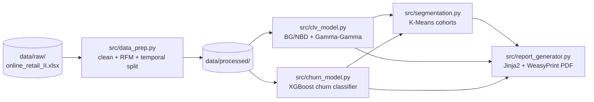

# CLV & Retention Intelligence Platform

A portfolio project analyzing customer lifetime value, churn risk, and
retention strategy on the [Online Retail II](https://archive.ics.uci.edu/dataset/502/online+retail+ii)
dataset (UK online retailer, Dec 2009 – Dec 2011, ~1.07M transaction line
items).

> **Status:** All 5 stages (data prep, CLV model, churn model,
> segmentation, PDF report) are complete and validated against the real
> dataset.
>
> Stage 5 was originally scoped as an interactive Streamlit dashboard;
> that was replaced with an automated PDF report (`src/report_generator.py`)
> instead — a static, shareable artifact rather than an app someone has
> to run and click through, better suited to a periodic retention report.

## Architecture



## Setup

```bash
python3 -m venv .venv
source .venv/bin/activate
pip install -r requirements.txt
```

On macOS, two libraries need Homebrew packages the Python wheels don't bundle:
```bash
brew install libomp    # required by xgboost
brew install pango     # required by weasyprint (PDF rendering)
```
(`report_generator.py` sets `DYLD_FALLBACK_LIBRARY_PATH` itself before
importing WeasyPrint, so no manual env var is needed once Pango is
installed — but the Homebrew package itself is still required.)

Place the raw dataset at `data/raw/online_retail_II.xlsx` (or `.csv`) —
not committed to the repo.

## Running each stage

```bash
# Stage 1: clean data, compute RFM, split calibration/holdout
python src/data_prep.py --raw-path data/raw/online_retail_II.xlsx

# Stage 2: fit BG/NBD + Gamma-Gamma, predict and validate 6-month CLV
python src/clv_model.py

# Stage 3: define churn, engineer features, tune + evaluate XGBoost
python src/churn_model.py

# Stage 4: K-Means segmentation on CLV + churn risk + RFM
python src/segmentation.py

# Stage 5: generate the PDF retention report from all prior outputs
python src/report_generator.py --run-name "2025-Q4"
```

Each stage logs its key metrics into `outputs/metrics.json` under its own
key, so re-running one stage doesn't erase another's results.

## Testing

```bash
pytest tests/ -v
```

## Data prep results (real dataset)

Raw rows: 1,067,371 → cleaned: 802,644

| Cleaning step | Rows dropped | Reason |
|---|---:|---|
| Null CustomerID | 243,007 | No customer to attribute the purchase to |
| Cancelled invoices ('C' prefix) | 18,744 | Cancellation, not a completed purchase |
| Non-product stock codes | 2,913 | Postage/discount/adjustment/fee entries, not goods |
| Zero/negative quantity | 0 | (already captured by the cancellation step on this dataset) |
| Zero/negative price | 63 | Data error or non-sale line item |

Non-product stock codes actually found: `ADJUST`, `ADJUST2`, `BANK CHARGES`,
`C2`, `D`, `DOT`, `M`, `PADS`, `POST`.

**Temporal split** (6-month holdout, matching the CLV prediction horizon):
- Calibration ends 2011-06-09
- Calibration: 4,942 customers, 25,999 invoices
- Holdout: 3,482 customers, 10,605 invoices

## CLV model results (real dataset)

BG/NBD + Gamma-Gamma fit on 4,942 calibration customers (1,609 of them
one-time buyers, frequency = 0), predicting 6-month CLV and validating
against actual holdout spend (undiscounted, to match holdout actuals):

- **Independence check:** Pearson r = 0.129 between frequency and
  monetary value on the 3,333 repeat customers — well under the 0.3
  warning threshold, no caveat needed.
- **MAE = £614, RMSE = £3,523** — the large MAE/RMSE gap reflects a
  heavy-tailed spend distribution (a handful of large-account customers
  dominate squared error).
- **MAPE (nonzero actuals) = 98.8%, median APE = 47.3%**, with 48.0% of
  customers excluded from MAPE because they made no holdout purchase at
  all. The mean is pulled far above the typical case by a small number of
  customers whose behavior changed sharply between periods (e.g. a
  customer with 18 calibration-period orders who spent only £51 in the
  holdout window against a £5,853 prediction) — reported both ways rather
  than letting the mean stand alone.
- **Spearman rank correlation = 0.624** — the model ranks customers by
  value considerably better than it predicts their exact spend, which
  matters more for a targeting use case (segmentation, campaign
  selection) than dollar-accurate forecasts do.
- See `outputs/plots/clv_predicted_vs_actual.png`: the vertical stripe at
  x=0 is the ~48% of calibration customers who didn't purchase again in
  the holdout window — visible evidence the model over-predicts spend for
  customers who actually go quiet, the flip side of the churn problem
  Stage 3 addresses directly.

**Why MAPE is so much higher than median APE — outliers, and which ones.**
`outputs/clv_ape_distribution.png` and `outputs/clv_worst_predictions.csv`
(top 20 by APE, saved every run) show this is driven by two *different*
customer tails, not one systematic problem:
- **RMSE's tail:** large accounts the model under-predicted (e.g. one
  customer with 0 calibration-period purchases — 22 days of observed
  history — went on to spend £168k in holdout; the model correctly
  reverted to a population-average prediction given almost no
  information, and no amount of RFM feature engineering predicts a phase
  change in behavior the model hasn't observed yet).
- **MAPE's tail:** previously active customers (some with 10–30
  calibration purchases) whose holdout spend collapsed to under £143.
  Percentage error is mechanically unstable near zero — a £150 absolute
  miss against a £9 actual reads as 1,625% error even though the miss
  itself is modest. These are two disjoint sets of customers, confirmed
  by comparing the top-APE and top-absolute-error tables directly.

Takeaway for the writeup: report MAPE, median APE, and Spearman together,
not MAPE alone — individual-level CLV prediction has legitimately high
variance for customers with irregular purchase patterns, and Spearman's
rank correlation (0.624) is the more decision-relevant number for
targeting/prioritization use cases, where getting the ranking right
matters more than dollar-exact forecasts.

## Churn model results (real dataset)

Churn threshold: **119 days** (90th percentile of the inter-purchase-gap
distribution across all calibration customers — see
`outputs/plots/churn_recency_threshold.png`). A customer is labeled
churned if their days-since-last-purchase, as of the calibration cutoff,
exceeds this. **Overall churn rate: 54.0%.**

That 54% is much higher than the "10%" a p90 threshold might suggest,
and it's worth explaining rather than leaving as a surprising number: it's
driven almost entirely by one-time buyers. The threshold is derived from
gaps *between two purchases* (repeat-buyer behavior), then applied to
*days since the single purchase* for one-time buyers — whose one
transaction could have landed anywhere in the ~2-year window, so most of
them already look "overdue" by construction. Churn rate is 77.3% among
one-time buyers (n=1,609) vs. 42.8% among repeat buyers (n=3,333) —
confirmed by checking the breakdown directly, not assumed.

Three models were trained (train/test split 3,953/989, stratified,
XGBoost tuned via 20-iteration random search + stratified 5-fold CV per
feature set):

| Model | Features | ROC-AUC | Precision | Recall |
|---|---|---:|---:|---:|
| Recency-only baseline | `days_since_last_purchase` (LogisticRegression) | 1.000 | 1.000 | 1.000 |
| Non-recency | frequency, T, monetary_value, purchase_trend, inter_purchase_interval_std | 0.955 | 0.885 | 0.865 |
| Full | non-recency + `days_since_last_purchase` | 1.000 | 1.000 | 1.000 |

The recency-only baseline hits AUC=1.000 exactly — not a bug, an expected
tautology: `days_since_last_purchase` deterministically **defines** the
churn label, so a model given that one feature perfectly reconstructs it,
and the full model (which also has that feature) can't do any better.
SHAP confirms this mechanically: `days_since_last_purchase` has mean |SHAP|
of 4.17, an order of magnitude above the next feature (`purchase_trend`
at 0.35) — see `outputs/plots/churn_shap_summary.png`.

**The real finding is the non-recency row**: purchase frequency, tenure,
average order value, spend trend, and purchase-timing variability —
*without* knowing recency at all — predict churn with 0.955 AUC on their
own. That's the number that reflects genuine behavioral signal rather
than recovering the label's own definition, and it's the one the writeup
leads with, per the plan to frame this around what non-recency features
add rather than the (guaranteed, uninformative) full-vs-recency-only
delta.

**Residual-leakage check on the 0.955 non-recency AUC.** An AUC that high
on a "non-recency" feature set is itself worth being suspicious of before
reporting, so two secondary leakage paths were checked directly rather
than assumed away:
- **`T` (tenure) mechanically bounds the label**: `days_since_last_purchase
  ≤ T` always, so `T < 119` guarantees `churned = 0`. True for 10.3% of
  customers (507/4,942) — but `T`'s own single-feature AUC is only 0.527,
  barely above chance, so this constraint explains very little of the
  model's power.
- **`purchase_trend` correlates -0.607 with `days_since_last_purchase`**
  (expected — it's derived from purchase timing within the calibration
  window, so it's structurally recency-adjacent, if not recency itself).
  Tested by dropping it entirely: AUC only falls from 0.955 to **0.946**
  using just frequency/T/monetary_value/inter_purchase_interval_std — so
  `purchase_trend` isn't carrying the result either.
- No single non-recency feature's solo AUC exceeds 0.765 (`frequency`
  alone) — `monetary_value` 0.691, `purchase_trend` 0.678,
  `inter_purchase_interval_std` 0.604, `T` 0.527. The 0.946–0.955 comes
  from XGBoost combining several partially-informative, non-redundant
  signals, not one feature secretly encoding the threshold. This is
  consistent with the plainer explanation already on record: one-time
  buyers churn at 77.3% vs. 42.8% for repeat buyers (frequency, the
  strongest single feature, is picking that up directly).

## Segmentation results (real dataset)

K-Means on `predicted_clv`, `predicted_churn_proba`, `frequency`,
`days_since_last_purchase`, and `total_calibration_spend` (log1p-transformed
where skewed, then standardized — see decisions below).

**K=2**, chosen by silhouette score, which is monotonically decreasing
across K=2..8 (0.462 → 0.339, see `outputs/plots/segmentation_k_selection.png`)
— no local peak at a higher K, so the coarsest split is also the best-separated
one. The elbow curve doesn't show an unambiguous bend either; silhouette
(the deciding criterion per the project's stated rule) settles it at K=2.
This isn't a weak result so much as a real property of the data: `log1p(CLV)`
and churn probability correlate at **-0.67** — value and risk move together
strongly enough that they act as one dominant axis rather than four
independent quadrants, so finer K just subdivides within already-similar
regions instead of finding new structure.

| Cluster | Label | n | % | Mean CLV | Mean churn proba | Mean frequency | Mean days since last purchase | Mean calibration spend |
|---|---|---:|---:|---:|---:|---:|---:|---:|
| 0 | High-Value / Low-Risk | 2,391 | 48.4% | £1,349 | 0.077 | 6.56 | 51 | £4,318 |
| 1 | Low-Value / At-Risk | 2,551 | 51.6% | £198 | 0.973 | 1.05 | 283 | £705 |

Despite differing sharply on *mean* churn probability, the underlying
per-customer distribution is strongly bimodal (population median = 0.98,
25th/75th percentiles = 0.008/0.995 — the churn classifier is
near-perfectly separated), so cluster purity was checked directly rather
than inferred from the means: 93.0% of cluster 0 and 98.1% of cluster 1
sit on the "expected" side of the 0.5 churn threshold — the clusters are
genuinely well-separated on risk, not just on average.

**RFM-only stability check: ARI = 0.417** (same K=2, same customers, RFM
features only vs. the full feature set). Interpreted honestly rather than
against a pass/fail bar: 0.417 is meaningfully above 0 (chance agreement)
but well below 1 (identical clustering) — CLV and churn probability
change roughly half of customers' cluster assignment relative to what raw
RFM alone would produce, so they're adding real information, not just
restating what RFM already implies. Given the -0.67 CLV/churn
correlation above, this makes sense: RFM's `frequency` and `spend`
correlate with CLV too, but recency-derived churn risk carries
information the RFM-only clustering weighs differently.

**Bug caught before shipping**: the first version of `label_clusters`
compared each cluster's mean churn probability to the *population
median* (mirroring the CLV logic) rather than a fixed threshold. Because
the churn classifier is so well-separated, the population median churn
probability is ~0.98 — so a cluster averaging 97.3% churn probability
still fell fractionally under that skewed median and was labeled
"Low-Risk." Caught by reading the actual `segment_profiles.csv` output
rather than trusting the label string, not by a test. Fixed by comparing
against the fixed 0.5 threshold from `churn_model.py`'s
`CLASSIFICATION_THRESHOLD` instead — churn probability has a real
absolute reference point (50/50), unlike CLV, so it shouldn't be judged
relative to a population median that can itself be skewed.

## Report generator results (real dataset)

`python src/report_generator.py --run-name "2025-Q4"` produces
`outputs/reports/retention_report_2025-Q4.pdf` — an 11-page PDF covering
executive summary, cohort breakdown, priority watchlist, model validation
appendix, simulated campaign ROI, and data/methodology notes. Every
number in it is read from `outputs/metrics.json` and the per-stage CSVs;
nothing is hardcoded or re-derived independently of the pipeline's own
saved outputs.

**Toolchain:** Jinja2 + WeasyPrint, not the originally-scoped
`pdfkit`/`wkhtmltopdf` fallback — WeasyPrint installed and rendered
successfully once Pango was available via Homebrew (`brew install pango`);
no fallback was needed. The one wrinkle: Homebrew on Apple Silicon
installs to `/opt/homebrew`, which isn't on the default library search
path `ctypes`/`dlopen` checks, so WeasyPrint failed with
`cannot load library 'libgobject-2.0-0'` until `DYLD_FALLBACK_LIBRARY_PATH`
included `/opt/homebrew/lib`. `report_generator.py` sets that
environment variable itself before importing `weasyprint`, so this is
transparent to anyone running the script — the Homebrew package still
has to be installed first, though.

**Bug caught by reading the actual rendered PDF, not by a test.** The
Priority Watchlist's first draft reused each customer's `segment_label`
(their K-Means *cluster's* label) to pick a recommended action. Every
single watchlist row — customers individually at 96-99% churn
probability — came out "Monitor; loyalty touch," the action for the
*Low-Risk* cluster. The mechanism: these are exactly the ~7% of
"High-Value / Low-Risk" cluster members who are individual outliers
within an otherwise low-risk cluster (see the cluster-purity numbers in
the Segmentation results above) — real customers whose cluster's
*average* risk is low but whose *own* risk is high, and the watchlist
is specifically supposed to find those people. Fixed by computing each
watchlist customer's value/risk tier from their own `predicted_clv` and
`predicted_churn_proba` directly (population-median CLV split, fixed 0.5
churn threshold — the same rule `segmentation.py` uses, just applied
per-customer instead of per-cluster-mean), not by trusting their cluster
assignment. This is the second time in this project a labeling bug
shipped from reusing a population/cluster-level reference point where an
individual-level one was needed (see the segmentation mislabeling bug
above) — worth remembering as a pattern, not just two unrelated bugs.

**Simulated campaign ROI** (500 customers, £5/outreach, 15pp assumed
retention lift — all stated in the report itself): recommended targeting
(highest CLV × churn probability) produces an estimated **£100,503**
expected value saved vs. **£56,650** for random targeting of the same
size — a **£43,853** uplift driven entirely by the targeting rule itself,
since the retention-lift assumption is held identical across both
strategies.

## Key modeling decisions and trade-offs

- **No product-category feature.** The dataset has no category/department
  field, only `StockCode` and free-text `Description`. Inferring one
  (prefix clustering or NLP) would be a side-project of its own and adds
  fragility for a feature that isn't core to the project. Dropped in
  favor of RFM + purchase-trend + inter-purchase-interval-variance
  behavioral features.
- **Non-product stock codes are filtered via an explicit known-code list
  plus a heuristic backstop** (any code containing no digits at all).
  The heuristic missed `ADJUST2` on first pass — it has a trailing digit,
  the same shape as a real product code like `85123A` — caught by
  inspecting price outliers and added to the explicit list.
- **Line items are collapsed to one row per invoice** before computing
  RFM, since BG/NBD models transactions, not line items; not collapsing
  would overstate purchase frequency for multi-item orders.
- **Churn is defined from the recency distribution** (p90 of inter-purchase
  gaps = 119 days), and the churn classifier reports three models —
  recency-only, non-recency, and full — instead of just "full vs.
  recency-only," because the label is a deterministic threshold on
  recency: a recency-only *or* full model both hit AUC=1.000 by
  construction, so that comparison alone can't show what non-recency
  features add. The non-recency-only model (0.955 AUC) is the one that
  actually answers the question, and it's where the writeup's emphasis
  goes.
- **The `lifetimes` "recency" field (time between first and last
  purchase) is deliberately excluded from the churn feature set**,
  keeping only `T` (tenure). Combined with `T`, it would let a tree
  ensemble algebraically reconstruct `days_since_last_purchase` (= T −
  recency) — the literal churn-defining variable — inside the
  "non-recency" model, undermining that comparison without it being
  obvious from the feature name alone.
- **Gamma-Gamma's frequency/monetary independence assumption is checked**
  via Pearson correlation on calibration data (0.129 — passed cleanly);
  if it had exceeded 0.3 the model would proceed anyway (mild violations
  are standard practice) with the correlation and caveat reported, not
  hidden.
- **CLV validation reports MAE, RMSE, and Spearman rank correlation
  alongside MAPE**, and MAPE excludes customers with zero actual holdout
  spend (division by zero) — with the excluded percentage reported. A
  median-APE figure was added after the real run showed the mean MAPE
  (98.8%) was itself misleading, dominated by a few customers with large
  behavior swings between periods — median APE (47.3%) is reported
  alongside it rather than in place of it.
- **The CLV prediction horizon is undiscounted (`discount_rate=0.0`) for
  validation**, specifically so it's comparable to the raw, undiscounted
  holdout actuals; a nonzero rate is exposed via `--discount-rate` for
  business-facing figures where discounting future revenue is the point.
- **Test fixtures that call library random-data generators must seed the
  RNG the library actually uses, not just `np.random.default_rng(...)`.**
  `lifetimes.generate_data.beta_geometric_nbd_model` draws from NumPy's
  legacy global RNG (`np.random.beta`/`gamma`/`exponential`), which a
  local `Generator` instance doesn't touch or seed. The CLV smoke test
  fixture passed in isolation but failed intermittently in the full suite
  because its "seeded" fixture wasn't actually seeded — convergence
  depended on whatever global RNG state other tests left behind. Fixed by
  calling `np.random.seed(...)` explicitly before generating the fixture.
- **Segmentation features are log1p-transformed (CLV, frequency,
  calibration spend) then standardized before K-Means**, since these are
  non-negative and heavily right-skewed — without it, Euclidean distance
  would be dominated almost entirely by whoever has the single largest
  CLV/spend value. Churn probability is already bounded [0,1] and
  roughly symmetric, so it's standardized but not log-transformed.
- **Segmentation's monetary feature is `total_calibration_spend`
  (computed from raw invoices), not `lifetimes`' `monetary_value`.** The
  latter is 0 by convention for one-time buyers (it's an average of
  *repeat*-transaction value only) — using it directly would make a
  one-time buyer who spent £5,000 in a single order look like they spent
  nothing, which is fine for Gamma-Gamma's internal math but wrong for a
  cohort-labeling feature meant to reflect actual customer value.
- **RFM-only stability check (ARI) uses the same K as the full model**,
  fit independently on RFM-only features vs. the full feature set, on
  the same customers — so the comparison isolates the effect of the
  feature set, not a simultaneously-varying K. Result: ARI=0.417,
  reported and interpreted honestly rather than judged against a
  pass/fail bar (see Segmentation results above) — CLV and churn
  probability meaningfully change cluster assignments relative to RFM
  alone, without being a wholesale re-clustering either.
- **Cluster labels are derived from actual centroid values compared
  against a reference point, not hardcoded to cluster index** — but the
  *reference point* has to fit the feature: population median for CLV
  (no absolute reference exists), a fixed 0.5 threshold for churn
  probability (which does have one). Using the population median for
  both initially mislabeled a 97%-churn-probability cluster as
  "Low-Risk," because the churn classifier is so well-separated that the
  population median churn probability is itself ~0.98. See Segmentation
  results above for how this was caught.
- **The campaign simulator's ROI is illustrative, not validated** — it
  reuses the same CLV model to both select and score a targeting
  strategy, with no independent campaign-outcome data to check against.
  Labeled directly in the report itself (a highlighted callout box), not
  just here.
- **Stage 5 became a PDF report instead of a Streamlit dashboard** — a
  static, shareable artifact fits a periodic retention report better
  than an app someone has to run locally. WeasyPrint (Jinja2 → HTML →
  PDF) worked directly once Pango was installed via Homebrew; no
  `pdfkit`/`wkhtmltopdf` fallback was needed.
- **The watchlist's per-customer recommended action is computed from
  that customer's own CLV/churn values, not their cluster's label** —
  see Report generator results above for the bug this caught: reusing
  the cluster-mean-based label mislabeled every high-risk watchlist
  customer as "Low-Risk," since the watchlist selects exactly the
  individual outliers within an otherwise low-risk cluster.

## Limitations

- Single retailer, ~90% UK transactions — findings won't generalize to
  other markets without revalidation.
- ~25% of raw rows have no CustomerID and are dropped entirely; those
  purchases are invisible to the whole platform.
- No product-category data (see above).
- 3.25% of rows are exact duplicates of unclear origin (repeat entries
  vs. export artifact); retained as-is since deduping would require an
  assumption the data doesn't support.
- PDF report generation requires `brew install pango` on macOS (and
  `brew install poppler` separately, only if you want to preview the PDF
  page-by-page as images rather than opening the file directly) — not a
  pure-`pip install` setup end to end.
